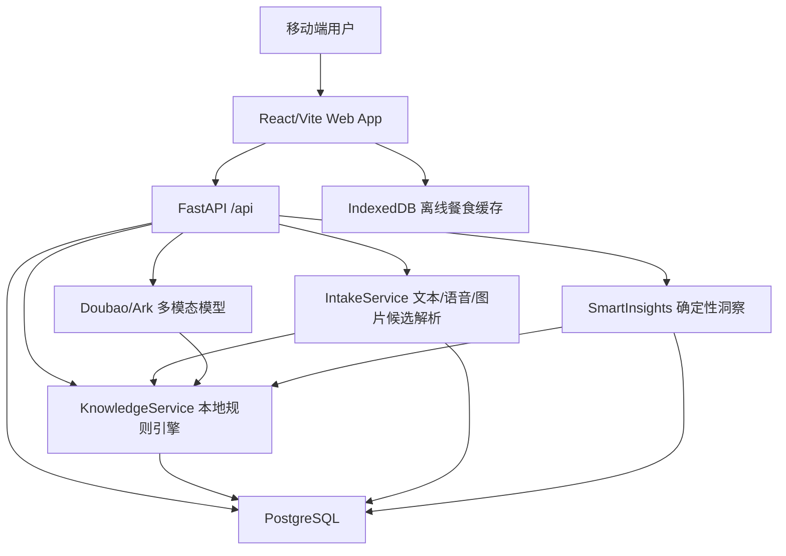
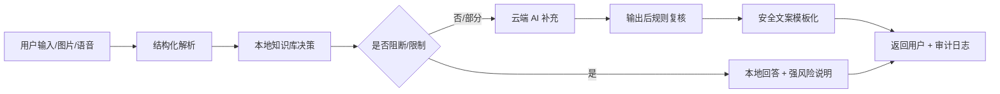

# Prism Metabolic Console 现状报告与商业化成长路线

生成日期：2026-05-30
项目路径：`/home/win/Project/prism---metabolic-console`
报告范围：项目文档、前端源码、后端源码、数据库模型、AI/知识库/Intake/Insights 服务、测试与部署文件、当前竞品公开功能参考、商业化路线规划。
审阅方式：主线程本地扫描 + 4 个子 agent 并行只读审阅；未回退或清理仓库中既有改动。

> 2026-05-31 复核提示：本报告保留了 2026-05-30 快照中的风险判断。其后认证安全、生产配置 gate、数据权利、灰度 runbook、CI/test/build 和若干商业化骨架已继续推进；当前工程事实请优先参考 `docs/COMMERCIALIZATION_READINESS.md` 与 `docs/GRAY_RELEASE_RUNBOOK.md`。

---

## 1. 执行摘要

Prism Metabolic Console 当前已经不是空壳原型，而是一个“功能型 MVP 到 Alpha+”阶段的 AI 代谢健康记录产品。它已经具备移动端 Web 体验、账号体系、饮食日志、多模态记餐、AI 对话、拍照识别、语音/文本候选确认、慢病/过敏档案、本地知识库规则引擎、智能洞察消息、IndexedDB 离线缓存、FastAPI 后端、PostgreSQL 数据模型、Alembic 迁移、Docker/云端部署说明和后端测试。

从产品方向看，它的差异化不是单纯 calorie counter，而是“代谢风险感知的 AI 饮食记录与健康提醒”：用户记录饮食后，系统结合高血压、高脂血症、痛风/高尿酸、2 型糖尿病、过敏等健康背景，做钠、嘌呤、热量、宏量营养、纤维和食物风险提醒。它已经有本地规则优先、AI 云端补充的雏形，这是健康类 AI 产品里非常重要的可信边界。

但从商业上线标准看，当前还不能直接面向真实用户开放商用。最大短板集中在真实短信与运营告警、正式法务复核、真实支付、生产监控、知识库覆盖、端到端 QA 和真实用户验证；认证安全、生产配置 gate、基础数据权利、CI/CD 验证和上传安全已经有后续工程补强。

建议商业化终局不要只复制 MyFitnessPal 或薄荷健康的“大食物库 + 计卡路里”，而应做成“AI 原生的代谢健康控制台”：前期以饮食记录、拍照/语音记餐、慢病风险提示、趋势报告建立日常粘性；中期加入营养师审核知识库、体检报告 OCR、可穿戴/体脂秤/血糖设备接入、订阅与运营后台；后期演进为个人端 + 营养师工作台 + 机构慢病管理的双边平台。

---

## 2. 当前项目定位

### 2.1 当前产品一句话

Prism Metabolic Console 是一个面向代谢健康管理的 AI 饮食记录与风险提醒应用，主张用拍照、语音、文本和聊天降低记餐成本，再用慢病/过敏档案和本地知识库约束 AI 建议。

### 2.2 当前目标用户画像

- 有减脂、控糖、控盐、控嘌呤、血脂管理需求的人群。
- 已有高血压、高尿酸/痛风、2 型糖尿病、高脂血症等代谢相关健康背景的人群。
- 希望用 AI 对话、拍照和语音减少手动记餐负担的用户。
- 未来可扩展到营养师、健康管理师、体重管理机构、企业健康福利和慢病随访场景。

### 2.3 当前产品核心价值

- 记录体验：手动、文字、语音、拍照、聊天多入口记餐。
- 个性化风险：结合用户病史和过敏做本地规则评估。
- AI 可控性：本地规则可阻断云端放宽建议，降低“模型胡说”的健康风险。
- 行为反馈：通过智能洞察提示漏餐、钠超标、嘌呤风险、热量结构、纤维不足等问题。
- 移动优先：当前 UI 更像手机 Web/PWA 的产品形态。

---

## 3. 技术栈与架构现状

### 3.1 前端

- 框架：React 19 + TypeScript + Vite。
- 状态：以 `hooks/useAppData.ts` 为主的全局应用状态。
- 样式：`index.css` + 组件内 class；移动优先。
- 本地存储：`localStorage` 保存 token 和会话状态；Dexie/IndexedDB 保存离线餐食缓存。
- 富文本：`marked` + `DOMPurify` 渲染 AI Markdown 回复。
- 关键依赖：`dexie`、`dompurify`、`marked`、`react`、`react-dom`。

### 3.2 后端

- 框架：FastAPI。
- 数据库：PostgreSQL + SQLAlchemy Async + Alembic。
- 认证：JWT access/refresh token + bcrypt 密码哈希。
- AI：Volcengine Ark / Doubao 多模态模型。
- 上传与图像：`python-multipart`、Pillow。
- 测试：pytest + pytest-asyncio。
- API 前缀：统一挂载在 `/api`。

### 3.3 数据与智能架构

### 3.4 源码规模

本次按排除 `node_modules`、`dist`、后端虚拟环境、pytest cache、`__pycache__` 后统计，主要源码/文档约 108 个文本文件、约 21,153 行。最大的业务文件集中在：

| 文件 | 行数 | 说明 |
|---|---:|---|
| `backend/app/services/intake.py` | 1603 | 文本、语音、图片候选解析与确认 |
| `components/views/ChatView.tsx` | 1479 | AI 聊天、多模态录入、候选确认 |
| `backend/app/services/insights.py` | 1072 | 智能洞察规则与持久化 |
| `backend/app/api/routes/chat.py` | 919 | 聊天、流式回复、图片识别 |
| `components/views/LogView.tsx` | 901 | 饮食日志 UI 与手动记餐 |
| `services/api.ts` | 623 | 前端 API 客户端 |
| `backend/app/services/ai_service.py` | 599 | Doubao/Ark AI 调用 |
| `components/views/MedicalArchivesView.tsx` | 506 | 健康档案 |
| `backend/app/services/knowledge/service.py` | 501 | 本地知识库规则决策 |
| `services/offline.ts` | 449 | IndexedDB 离线同步 |

---

## 4. 已实现功能清单

### 4.1 启动、登录、注册与账号

已实现：

- Splash 启动页。
- token 检查与自动进入首页。
- 手机号 + 密码登录。
- 手机号 + 验证码登录。
- 注册流程。
- 忘记密码与重置密码。
- refresh token 自动刷新。
- 退出登录。
- 游客模式演示数据。
- 个人资料读取与更新。
- 密码修改。
- 每日目标值计算。

当前问题：

- 验证码服务是开发模式，验证码会回传给前端。
- 没有真实短信通道。
- 没有短信/IP/设备频控、防刷、失败锁定。
- token 存在 `localStorage`，商业健康产品需要重新评估 XSS 风险。
- refresh token 无状态，无撤销表、设备会话、`jti` 或 token version。
- 注册页已有协议勾选，但用户协议和隐私政策页面未真正接入。

### 4.2 首页

已实现：

- 今日代谢余额展示：热量、钠、嘌呤。
- 最新智能洞察卡片。
- 未读洞察数量。
- 首页进入设置、消息/洞察记录。
- 演示用户模式。

当前问题：

- 首页更适合作为“每日控制台”，但趋势、连续天数、风险雷达、目标达成率还较弱。
- 对商业用户来说，应增加“今天下一步做什么”的行动建议，而不只是余额展示。

### 4.3 生命日志 / 饮食日志

已实现：

- 按日期查看餐食。
- 前一天/后一天切换。
- 手动新增餐食。
- 编辑和删除已同步餐食。
- 显示 BMI、BMR、目标热量。
- 显示热量、钠、嘌呤、蛋白质、碳水、脂肪、纤维。
- 显示餐食来源标签、风险提醒和本地估算。
- 前端本地 `estimateMealNutrition()` 做手动记餐的营养估算。
- 餐食创建失败时可写入离线缓存待同步。

当前问题：

- 离线仅覆盖“手动新增失败后的 pending 缓存”。
- AI/语音/拍照确认、编辑、删除没有完整离线队列。
- pending 状态和冲突状态没有足够清晰的 UI。
- 退出登录会清理本地数据，有丢失未同步记录风险。
- 食物数据库规模仍远小于商业产品。
- 没有条码扫描、常吃食物、菜谱、餐厅/外卖识别、批量复制昨日餐。

### 4.4 AI 聊天

已实现：

- 创建和恢复聊天 session。
- 加载历史消息。
- 普通 JSON 回复 fallback。
- SSE 流式回复。
- Markdown 渲染与 DOMPurify 安全清洗。
- 图片上传并识别。
- 文本记餐。
- 语音记餐。
- 候选确认后写入日志。
- 严格/温和等前端展示模式。
- 本地规则完整或阻断时，后端可直接返回本地 Markdown，不调用云端。

当前问题：

- 聊天 session 后端支持列表和删除，但前端基本只使用一个 session，没有完整会话管理。
- “分析师/教练”模式主要停留在前端表现，没有真正传给后端并持久化。
- 没有模型输出后的结构化安全复核层。
- AI 成本、延迟、失败率、模型输出风险没有监控面板。
- 没有用户对 AI 建议的反馈闭环。

### 4.5 拍照记餐

已实现：

- 后置摄像头调用。
- 闪光灯能力探测。
- 拍照。
- 相册导入。
- 前端图片压缩。
- 上传图片到后端识别。
- 后端调用 Doubao 多模态模型输出 JSON 食物候选。
- 候选进入聊天/确认流程。

当前问题：

- 图片识别的食物、份量、营养值本质是模型估计，需要用户确认和置信度提示。
- 上传安全只做了基础 MIME/大小限制，缺文件头探测、恶意文件处理、EXIF 清理、安全存储策略。
- 无上传进度、取消、失败重试。
- 无餐盘分割、多食物份量校正、参照物辅助估量。

### 4.6 语音/文本记餐

已实现：

- 语音 transcript 拆分。
- 自动推断餐次和时间。
- 抽取份量与模糊中文份量。
- 文本判断是否像饮食记录。
- 缺食物时要求补充。
- 可用上一轮上下文补全分量/口味。
- 候选重评估。
- auto confirm 机制。

当前问题：

- 浏览器 SpeechRecognition 兼容性有限。
- 按当前时间推断餐次可能误判。
- 中文口语、地方菜、外卖品牌、复合菜仍需要更大知识库和标注数据。
- “自动确认”商业上线前应谨慎开放，尤其对慢病用户。

### 4.7 候选确认

已实现：

- 文本/语音/拍照候选统一进入确认。
- 候选带 warnings、citations、recommendation_level、origin、fallback_status。
- 确认时后端重新评估并写入 `Meal`。
- 支持部分成功、失败项返回。

当前问题：

- 候选编辑能力需要继续增强，例如份量、食物替换、烹饪方式、调料、多人份拆分。
- 确认前的风险解释应更可读、更适合普通用户。
- 需要把“高风险建议不可被 AI 放宽”的规则明确展示给用户。

### 4.8 健康档案

已实现：

- 慢病/过敏记录 CRUD。
- 状态、趋势、数值、单位、AI 描述等字段。
- 病史变更后触发洞察刷新。
- 健康条件归一化与每日目标联动。

当前问题：

- 数据库层没有 `(user_id, condition_code)` 唯一约束，仅路由层防重复。
- 体检报告上传/OCR 未实现。
- 用药、实验室指标、血压/血糖/尿酸趋势未系统建模。
- 缺用户授权、医生/营养师备注、数据来源可信度。

### 4.9 本地知识库与规则引擎

已实现：

- 知识库表：疾病、食物、来源、疾病-食物规则、规则-来源映射、健康条件映射、审计日志。
- 当前种子库：4 个病种、26 个食物、104 条规则、10 个来源、19 条健康条件映射。
- 覆盖方向：高血压、高脂血症、痛风/高尿酸、2 型糖尿病。
- 规则决策：标准化健康条件、食物匹配、过敏/手动忌口硬阻断、规则合并、引用来源合并。
- fallback 状态：
  - `LOCAL_COMPLETE`
  - `LOCAL_PARTIAL_ALLOW_CLOUD`
  - `LOCAL_BLOCKED_NO_CLOUD`
  - `NO_LOCAL_MATCH_ALLOW_CLOUD`
- 如果本地判断 AVOID/LIMIT/过敏，云端不能放宽。
- 知识库评估和摘要可写审计日志。

当前问题：

- 食物覆盖太小，真实用户饮食会大量落到云端补充。
- `foods.json` 当前未充分填充 `risk_tags` / `allergen_tags`。
- 缺营养师/医学审核后台。
- 缺知识版本发布、回滚、灰度、差异审计。
- 缺对孕期、肾病、儿童、老年、运动员等特殊人群的边界。
- 现有 `domain/**` 更像未来契约层，未成为运行时核心抽象。

### 4.10 智能洞察

已实现：

- 确定性规则，不走 LLM。
- 覆盖漏餐提醒。
- 餐次热量提醒。
- 总钠提醒。
- 痛风/高尿酸用户嘌呤提醒。
- 宏量营养失衡提醒。
- 膳食纤维不足提醒。
- 本地知识库风险提醒。
- 正向反馈。
- 同餐候选压缩、严重度排序、每日非严重提醒数量限制。
- 生成 `AppMessage`，首页和消息中心联动。

当前问题：

- 洞察文案中英文一致性需要统一。
- 缺用户反馈、确认、忽略、稍后提醒等闭环。
- 缺长期趋势洞察，例如 7/30/90 天钠摄入、控糖稳定性、体重变化关联。
- 缺周报/月报。

### 4.11 消息中心

已实现：

- 消息列表。
- 未读数量。
- 按 WARNING/ADVICE/BRIEF 类型。
- 详情。
- 单条/全部已读。
- 删除。
- 进入消息页自动全部标记已读。

当前问题：

- 还不是完整通知体系，没有系统 push、站内信模板、运营消息、频控策略。
- “进入即全部已读”对商业产品可能不适合，应允许用户保留未读状态。

### 4.12 设置与资料

已实现：

- 身体参数编辑。
- 性别、年龄、身高、体重。
- 健康档案入口。
- 本地缓存统计和清理。
- 关于页。
- 退出登录。

当前问题：

- 全局助手偏好、干预强度、健康报表导出均显示未开放。
- 用户协议、隐私政策、检查更新未接入。
- 无账号注销、数据导出、数据删除入口。
- 无订阅、支付、发票、客服、意见反馈。

---

## 5. 后端 API 与数据库现状

### 5.1 API 模块

| 模块 | 能力 |
|---|---|
| `/auth` | 注册、登录、验证码、重置密码、refresh、个人资料、改密码、每日目标 |
| `/meals` | 创建、分页/日期查询、今日列表、日汇总、单条 CRUD、离线同步 |
| `/chat` | 会话创建/列表/详情/删除、普通消息、SSE 流式消息、食物图片识别、快捷记餐 |
| `/conditions` | 慢病/过敏 CRUD、分组查询 |
| `/messages` | 消息列表、未读数、详情、已读、全部已读、删除 |
| `/knowledge` | 疾病、食物、来源、规则查询、用户食物风险评估、问题摘要 |
| `/intake` | 语音/文本/图片解析、语音自动记账、候选重评、确认入库 |
| `/insights` | 刷新今日洞察、读取今日洞察消息 |

### 5.2 数据表

| 表 | 说明 |
|---|---|
| `users` | 手机号、密码哈希、昵称、头像、性别、年龄、身高、体重、状态、时间戳 |
| `meals` | 食物、份量、营养、餐次、日期、AI/来源元信息、同步状态、`client_id` |
| `health_conditions` | 慢病/过敏、code、status、trend、value、unit、AI 描述 |
| `chat_sessions` | 用户聊天会话 |
| `chat_messages` | 聊天消息、附件、模型和 token 信息 |
| `app_messages` | 应用内预警/建议/简报 |
| `diseases` | 知识库疾病 |
| `food_items` | 知识库食物 |
| `knowledge_sources` | 知识来源 |
| `disease_food_rules` | 疾病-食物规则 |
| `rule_source_maps` | 规则与来源映射 |
| `health_condition_mappings` | 用户健康条件到标准疾病映射 |
| `knowledge_audit_logs` | 知识库评估/摘要审计日志 |

### 5.3 Alembic 迁移

- `0001`：核心表。
- `0002`：知识库与审计。
- `0003`：餐食多模态元信息。
- `0004`：`client_id` 唯一约束改为按用户隔离。

### 5.4 离线同步后端策略

已实现：

- `meals` 支持 `client_id` 幂等。
- `(user_id, client_id)` 唯一约束。
- `/meals/sync` 上传 pending 餐食。
- 服务器按 `updated_at > last_sync_at` 回传服务端变更，最多 100 条。
- 已存在同 `client_id` 时标记冲突，当前基本是服务器优先。

缺口：

- 无软删除 tombstone。
- 无版本号/revision。
- 无服务端游标。
- 无分页续传。
- 无批量 update/delete 同步。
- 无字段级冲突详情。
- 前端没有清晰冲突解决 UI。

---

## 6. AI、知识库与健康安全边界

### 6.1 当前 AI 调用链

对话请求进入后端后：

1. 保存用户消息。
2. 读取聊天历史。
3. 读取用户健康档案。
4. 调用 `KnowledgeService.summarize_query_for_user`。
5. 如果本地规则完整或阻断，直接返回本地 Markdown。
6. 如果允许云端补充，把本地 guardrail 注入 Doubao 请求。
7. 流式或普通返回 AI 回复。
8. 知识库相关评估写入审计日志。

### 6.2 当前正向设计

- 本地优先，而不是完全依赖 LLM。
- 知识库可提供引用来源。
- 对 AVOID/LIMIT/过敏类判断，AI 不能放宽。
- 智能洞察用确定性规则，不走 LLM，便于解释和测试。
- Intake 候选确认前保留 warnings、citations 和 fallback 状态。

### 6.3 当前风险

- 安全控制仍偏 prompt 化，缺模型输出后的硬校验。
- 图片识别和份量估计误差不可避免。
- 食物匹配主要依赖字符串、同义词和规则表，面对真实世界菜名会漏判。
- 知识库覆盖太小，很多问题会进入云端补充。
- 缺医疗/健康免责声明和风险等级 UX。
- 缺营养师/医生审核流程。

### 6.4 建议的 AI 安全架构升级

商业化阶段必须增加“输出后规则复核”：云端模型的食物建议、份量建议、慢病建议要重新过本地规则，不允许模型生成与本地禁忌相反的结论。

---

## 7. 测试、构建与部署现状

### 7.1 本次验证结果

- 前端构建：`npm run build` 成功。
- 构建警告：Vite 提示主 JS chunk 约 559.56 kB，超过 500 kB 建议拆分；`services/api.ts` 动态导入受静态导入影响无法拆分。
- 后端测试：从仓库根目录直接运行 pytest 会因 `backend/pytest-cache-files-*` 权限目录报收集错误。
- 后端正确测试命令：`backend/.venv/bin/python -m pytest -q backend/tests`。
- 后端测试结果：47 passed，7 warnings。
- warnings 包括 pytest-asyncio loop scope、Pydantic class-based Config deprecated、passlib crypt deprecated。

### 7.2 已有测试覆盖

- Intake 文本/语音解析。
- 模糊份量。
- 澄清/拒绝/上下文补全。
- 候选重评估。
- 智能洞察规则。
- 洞察持久化。
- 聊天模型配置回退。
- JSON 提取。
- SSE 本地规则回答与云端流式代理。
- 验证码服务。
- 健康档案归一化。
- 每日目标。
- 知识库 seed 顺序/校验。

### 7.3 测试缺口

- 无前端测试脚本。
- 无 Playwright/Cypress E2E。
- 无注册登录、餐食 CRUD、离线同步、相机、语音、图片、候选确认、消息中心等端到端覆盖。
- 缺真实 PostgreSQL + Alembic + seed 集成测试。
- 缺认证、餐食、健康档案、知识库、消息路由完整 API 集成测试。
- 缺覆盖率、lint、typecheck、性能、压测、安全测试。
- 缺 CI 状态。

### 7.4 部署现状

已存在：

- 本地 Windows 脚本：`npm run dev:local` 调 PowerShell，准备 PostgreSQL、迁移、seed、启动 FastAPI 和 Vite。
- Docker compose：默认后端连接宿主机 `5433`，`db` 是 legacy profile。
- 云端方案：Vercel 前端 + Render Docker 后端 + Neon PostgreSQL。
- Render blueprint：包含 `DATABASE_URL`、`JWT_SECRET_KEY`、`ARK_API_KEY`、`DOUBAO_MODEL`、`CORS_ORIGINS`。
- Vercel SPA rewrite。

缺口：

- 云端自动 Alembic/seed 流程需明确。
- 缺发布流水线、回滚策略、环境隔离、备份恢复演练。
- 缺健康检查、结构化日志、错误告警、AI 成本监控。

---

## 8. 当前主要缺口与优先级

### 8.1 P0：上线阻断项

| 领域 | 问题 | 为什么阻断 |
|---|---|---|
| 认证 | 验证码开发模式且回传前端 | 真实用户环境下不可接受 |
| 安全 | 无短信/IP/设备限流和失败锁定 | 极易被刷接口或撞库 |
| token | refresh token 无撤销和设备会话 | 账号安全与登出语义不足 |
| 合规 | 协议、隐私政策、免责声明未接入 | 健康数据属于高敏感信息 |
| 上传 | 图片上传安全校验不足 | 存在恶意文件与隐私泄露风险 |
| 知识库 | 覆盖小且缺审核后台 | 慢病建议可信度不足 |
| AI 安全 | 缺输出后规则复核 | 模型可能生成与规则冲突建议 |
| 数据权利 | 无数据导出、删除、注销 | 商业化与合规必备 |
| 生产配置 | 默认 JWT secret / DB URL 可被误用 | 生产事故风险 |
| 监控 | 无错误、成本、延迟、审计面板 | 无法运营真实服务 |

### 8.2 P1：商业体验关键项

| 领域 | 问题 | 影响 |
|---|---|---|
| 食物库 | 缺大规模食物、品牌、外卖、条码 | 记录效率无法对标竞品 |
| 离线 | 只覆盖手动新增失败 | 移动端体验割裂 |
| 前端 QA | 无 E2E/前端测试 | 迭代风险高 |
| 会话 | AI 会话管理弱 | 用户长期使用不便 |
| 洞察 | 缺趋势和周报/月报 | 留存价值不足 |
| 报告 | 健康报告导出未开放 | 付费价值不足 |
| 设备 | 未接 HealthKit/Google Fit/体脂秤/血糖 | 代谢闭环不足 |
| 运营 | 无后台、客服、用户反馈、A/B | 难以商业增长 |

### 8.3 P2：增强项

- PWA 离线安装。
- 原生 App。
- 推送通知。
- 社区/课程/挑战。
- 菜谱/餐单计划。
- 家庭成员管理。
- B2B 机构工作台。
- 营养师服务市场。

---

## 9. 竞品功能对标

以下竞品参考基于截至 2026-05-30 的公开官网、帮助中心或应用商店信息。竞品功能不代表必须全部照搬，应按 Prism 的“AI 原生 + 慢病代谢风险”定位筛选。

### 9.1 国际竞品

| 竞品 | 核心能力 | 对 Prism 的启发 |
|---|---|---|
| MyFitnessPal | 大食物库、卡路里/宏量记录、条码扫描、Meal Scan、Premium 目标与分析 | 食物库、条码、常吃食物、拍照识别、付费分析是基础门槛 |
| Cronometer | 更细的微量营养素、验证食物库、条码、biometrics、营养报告 | Prism 若做慢病，应向“可信营养数据 + 报告”靠拢 |
| Lose It! | 卡路里目标、条码、Snap It 拍照识别、挑战与减重体验 | 拍照记餐要降低摩擦，同时要有目标和激励 |
| Lifesum | calorie tracker、meal plans、recipes、water、health score | 需要把记录变成可执行餐单和健康评分 |
| YAZIO | calorie counter、fasting、meal plans、recipes、barcode、macro tracker | 可考虑控糖/控脂场景外的轻断食与计划能力，但要谨慎健康边界 |
| Foodvisor | AI 图片识别、营养教练、餐单、饮食日志 | Prism 的拍照 AI 应配确认流和慢病规则，避免只做识别噱头 |
| Noom | 心理学课程、习惯改变、教练、食物记录 | Prism 需要行为改变内容和 coaching，不只是数据面板 |
| Healthify | AI coach、食物追踪、教练计划、CGM/代谢项目 | 中后期可向 AI + 人类专家 + 设备数据的混合服务演进 |

### 9.2 中国/本土相关产品

| 竞品 | 核心能力 | 对 Prism 的启发 |
|---|---|---|
| 薄荷健康 | 中文食物热量库、饮食/体重记录、食谱/内容、体重管理生态 | 中文本地食物库和内容运营是基本盘 |
| Keep | 运动课程、训练计划、社区、智能硬件、健康记录 | Prism 可连接运动与代谢，但不应一开始做泛健身 |
| 轻牛健康 | 体脂秤/身体数据记录、健康趋势、设备生态 | 体脂秤、体重、体脂、基础代谢等设备数据能补齐代谢画像 |

### 9.3 功能矩阵

| 功能维度 | 当前 Prism | 竞品成熟水平 | 建议优先级 |
|---|---|---|---|
| 手动记餐 | 已有 | 标配 | 已达 MVP，需增强效率 |
| 拍照识别 | 已有 | Foodvisor/Lose It/MyFitnessPal 已成熟 | P1 强化确认、份量、置信度 |
| 语音记餐 | 已有 | 多数竞品较弱 | 可做差异化 |
| AI 聊天 | 已有 | 新兴标配 | P0/P1 加安全复核和个性化 |
| 慢病规则 | 已有雏形 | 普通 calorie app 较弱 | Prism 核心差异化 |
| 食物库 | 很小 | 竞品巨大 | P1 必须扩展 |
| 条码扫描 | 无 | 国际竞品标配 | P1 |
| 微量营养素 | 无/弱 | Cronometer 强 | P2，慢病方向可提前 |
| 水记录 | 无 | Lifesum/YAZIO 常见 | P2 |
| 断食 | 无 | YAZIO/Lifesum 常见 | P2，需健康边界 |
| 课程/习惯 | 无 | Noom 强 | P2/P3 |
| 可穿戴/设备 | 无 | Healthify/Keep/轻牛相关 | P2/P3 |
| 报告导出 | 占位 | Cronometer 等较强 | P1/P2 付费点 |
| 社区挑战 | 无 | Keep/Lose It 等有 | P3 |
| 专家服务 | 无 | Noom/Healthify 有 | P3/P4 |
| 订阅付费 | 无 | 成熟竞品普遍有 | P2/P3 |
| B2B/机构 | 无 | 部分健康管理产品有 | P5/P6 |

### 9.4 Prism 应避开的陷阱

- 不要一开始和 MyFitnessPal 拼全球食物库规模。
- 不要把 AI 回复包装成诊断或治疗。
- 不要弱化“用户确认”，尤其图片识别和自动记餐。
- 不要把慢病建议全交给 LLM。
- 不要过早做社区，当前最重要的是记录准确性、可信提醒、留存闭环。

---

## 10. 商业化产品终局目标

### 10.1 终局产品形态

Prism 最终应成为“个人代谢健康 AI 控制台”：

- 对个人用户：快速记餐、看趋势、知道今天怎么吃、收到慢病风险提醒、生成报告。
- 对高级用户：连接体脂秤、血糖、血压、运动、睡眠、体检报告，形成代谢画像。
- 对营养师/机构：管理用户、审核 AI 建议、查看风险趋势、制定餐单、跟踪执行。
- 对平台运营：维护知识库、运营内容、订阅付费、客服、数据分析、A/B 实验。

### 10.2 推荐商业模式

| 层级 | 收费对象 | 功能 |
|---|---|---|
| 免费版 | 个人用户 | 基础记餐、基础 AI 对话、有限拍照次数、基础洞察 |
| Pro 订阅 | 个人用户 | 无限 AI/拍照、趋势报告、慢病风险看板、报告导出、餐单建议 |
| Coach 订阅 | 高需求用户 | 营养师/健康管理师人工点评、周计划、复盘 |
| 设备/数据增值 | 个人用户 | 体脂秤、血糖、血压、可穿戴接入与分析 |
| B2B SaaS | 机构/企业 | 用户管理、机构工作台、运营报表、专家协作 |

### 10.3 产品北极星指标

建议北极星指标：每周完成 5 天及以上有效饮食记录且查看至少 1 次个性化洞察的活跃用户数。

原因：它同时衡量记录粘性、AI/洞察价值和代谢健康场景的真实使用，而不是单纯 DAU。

---

## 11. 完整成长路线

### Phase 0：安全收敛与可试用封版

目标：把当前 Alpha+ 整理成可控内测版本。

周期建议：2-4 周。

关键任务：

- 固化当前功能边界，关闭明显占位入口或改为清晰 waitlist。
- 补协议页、隐私政策页、AI/健康免责声明页。
- 注册、登录、聊天、拍照、候选确认、智能洞察全流程 smoke test。
- 统一中文文案和风险等级。
- 为 AI、图片识别、慢病建议增加“非医疗诊断”提示。
- 前端生产环境强制校验 `VITE_API_URL`。
- 后端生产环境强制校验 JWT secret、DB URL、CORS。
- 修复 pytest 根目录收集权限问题，或配置 pytest 收集目录。
- 建立最小 CI：前端 build + 后端 pytest。

验收标准：

- 内测用户可完成注册、登录、记餐、AI 问答、拍照识别、候选确认、查看洞察。
- 所有健康建议都有免责声明和风险边界。
- `npm run build` 与后端测试在 CI 通过。
- 无开发验证码回传到生产环境。

### Phase 1：生产基础设施与账号安全

目标：具备小规模真实用户灰度能力。

周期建议：4-6 周。

关键任务：

- 接入真实短信/OTP 服务。
- 验证码不回传前端。
- 加手机号、IP、设备、场景维度限流。
- 登录失败锁定与风控审计。
- refresh token 增加 `jti`、设备会话、撤销表。
- 增加账号注销、数据导出、数据删除。
- 上传文件头校验、EXIF 清理、恶意文件防护、存储隔离。
- 结构化日志、request_id、错误告警。
- AI 调用耗时、token/cost、失败率监控。
- 数据库备份与恢复演练。
- 明确云端 Alembic/seed 自动执行流程。

验收标准：

- 可承载 500-1000 名灰度用户。
- 登录/验证码接口有可观测频控。
- 生产配置误用默认 secret 时启动失败。
- 用户可导出和删除个人数据。
- AI 成本与错误率可看。

### Phase 2：记录体验与食物数据库补强

目标：从“能记”升级到“愿意每天记”。

周期建议：6-10 周。

关键任务：

- 建立中文食物库 v1：至少覆盖 3000-10000 个常见食物/菜品/品牌。
- 增加常吃食物、最近食物、收藏餐、复制昨日餐。
- 增加条码扫描和商品营养标签录入。
- 增加菜品别名、地方菜、外卖品牌映射。
- 拍照识别增加置信度、可编辑份量、多食物拆分。
- 图片/文本/语音候选统一支持编辑和重评估。
- 完整离线队列：新增、编辑、删除、候选确认。
- 冲突 UI：本地优先/服务器优先/手动合并。
- PWA install、弱网提示、上传进度和重试。

验收标准：

- 真实用户 7 日记餐留存显著提升。
- 常见中文饮食命中率达到可用水平。
- 条码和常吃食物可明显减少手动输入。
- 离线状态不丢数据。

### Phase 3：慢病可信闭环

目标：把 Prism 做成“代谢健康”而不是普通记账工具。

周期建议：8-12 周。

关键任务：

- 知识库扩展到更多疾病和特殊人群：脂肪肝、肾病早期、肥胖、妊娠期、老年等。
- 建立知识库后台：规则编辑、来源管理、审核、版本、回滚、灰度。
- 引入营养师/医学顾问审核流程。
- `risk_tags`、`allergen_tags`、营养风险标签补全。
- 云端 AI 输出后规则复核。
- 用户健康指标建模：血压、血糖、尿酸、血脂、体重、体脂、腰围。
- 体检报告 OCR 与手动录入。
- 周报/月报：钠、嘌呤、热量、宏量、纤维、风险食物、改善建议。
- 可导出 PDF/CSV 报告。

验收标准：

- 慢病用户能看到明确、可追溯、可解释的饮食风险提醒。
- 每条高风险建议可追溯来源与规则版本。
- 报告可作为 Pro 付费核心功能。
- AI 输出与本地规则冲突率可监控并趋近 0。

### Phase 4：商业化 MVP

目标：形成可收费、可运营、可客服、可增长的产品闭环。

周期建议：8-12 周。

关键任务：

- 订阅系统：免费/Pro/Coach 分层。
- 支付：国内可接微信/支付宝；海外可接 Apple/Google/Stripe。
- 权益控制：AI 次数、拍照次数、报告导出、长期趋势、专家服务。
- 运营后台：用户、订阅、消息、内容、知识库、反馈、风控。
- 客服与反馈：用户问题、AI 回复投诉、识别纠错。
- 增长系统：邀请、试用、优惠券、留存提醒。
- A/B 测试：引导、记餐入口、洞察文案、付费墙。
- 数据看板：激活、次留、7 留、记餐率、拍照使用率、付费转化。

验收标准：

- 可真实收款。
- 能按用户订阅状态控制功能。
- 运营人员可处理用户反馈和知识纠错。
- 关键增长漏斗可看。

### Phase 5：原生 App 与设备生态

目标：从移动 Web/PWA 升级到真正移动健康产品。

周期建议：12-20 周。

关键任务：

- iOS/Android 原生或跨平台 App。
- 推送通知。
- HealthKit / Google Fit 接入。
- Apple Watch / Wear OS 数据接入。
- 体脂秤、血压计、血糖仪、CGM 数据接入。
- 相机、语音、通知、后台同步体验原生化。
- App Store / 应用商店合规资料。
- 移动端崩溃监控、性能监控。

验收标准：

- App 商店可发布。
- 设备数据与饮食记录合并成代谢趋势。
- 推送提醒可提升日活和记餐完成率。

### Phase 6：机构与医疗健康生态

目标：从个人工具变成健康管理平台。

周期建议：6-12 个月。

关键任务：

- 营养师工作台。
- 机构用户管理。
- 分组干预、随访计划、批量消息。
- 专家审核 AI 建议。
- 机构报告和风控看板。
- 企业健康/保险/体检机构合作。
- 更严格合规评估：是否触及互联网诊疗、医疗器械软件、算法备案等边界。
- 数据隔离、权限、审计、合同与 SLA。

验收标准：

- 可服务机构客户。
- 专家与 AI 协同闭环可运营。
- 数据权限和审计达到 B2B 要求。

---

## 12. 里程碑 KPI

### 12.1 产品使用 KPI

| 阶段 | 指标 |
|---|---|
| 内测 | 注册完成率、首餐记录率、首日 AI 使用率、拍照识别成功率 |
| 灰度 | D1/D7 留存、每用户每周记餐天数、候选确认率、洞察查看率 |
| 商业化 | 免费转付费率、Pro 留存、报告导出使用率、AI 成本/付费收入比 |
| 成熟期 | 周活跃健康档案用户、设备连接率、专家服务续费率、B2B 客户留存 |

### 12.2 质量 KPI

| 领域 | 指标 |
|---|---|
| AI | P95 回复延迟、AI 失败率、输出后规则冲突率、用户纠错率 |
| 拍照 | 图片识别成功率、多食物识别准确率、份量编辑率 |
| 知识库 | 规则覆盖率、引用完整率、审核通过率、版本回滚次数 |
| 安全 | 登录失败率、验证码触发限流次数、异常 IP 次数 |
| 稳定性 | API P95、前端崩溃率、后端错误率、同步冲突率 |

### 12.3 商业 KPI

| 指标 | 建议目标方向 |
|---|---|
| CAC | 早期尽量通过内容/社群/慢病垂直渠道降低 |
| LTV | 依靠 Pro 报告、设备数据和 Coach 服务提升 |
| 付费转化 | 以拍照次数、趋势报告、慢病报告作为付费墙 |
| 毛利 | 严控 AI 图像识别成本，重用本地规则和缓存 |
| 续费 | 靠周报/月报、趋势改善和专家服务建立价值感 |

---

## 13. 合规与风险路线

### 13.1 数据合规

Prism 处理手机号、身体参数、慢病/过敏、饮食记录、可能的图片和体检报告。这些数据在中国语境下高度接近敏感个人信息，商业化必须至少完成：

- 隐私政策。
- 用户协议。
- 单独同意与明示授权。
- 数据最小化。
- 数据导出。
- 数据删除。
- 账号注销。
- 日志脱敏。
- 访问权限控制。
- 第三方 SDK/AI 服务披露。
- 数据跨境或第三方处理评估。

### 13.2 健康与医疗边界

当前产品应定位为健康管理、营养记录、生活方式建议，不应宣称诊断、治疗、处方或替代医生。特别是：

- AI 不给药物调整建议。
- AI 不做疾病诊断。
- 高风险症状引导就医。
- 对糖尿病、肾病、孕期、儿童等特殊人群做保守提示。
- 若未来进入医疗机构、医生处方、治疗建议或软件医疗器械范畴，需要重新做监管分类和注册路径评估。

### 13.3 生成式 AI 合规

需要：

- 标识 AI 生成内容。
- 记录 AI 调用和输出审计。
- 支持用户投诉与纠错。
- 对不当内容进行安全过滤。
- 明确第三方模型服务商。
- 对健康建议增加本地规则兜底。

---

## 14. 近期行动建议

### 14.1 立即做

1. 补齐协议、隐私政策、免责声明页面和注册链接。
2. 生产环境禁止开发验证码回传。
3. 配置生产 secret 强校验。
4. 补最小 CI。
5. 修复 pytest 根目录收集权限问题。
6. 增加 AI 输出后规则复核。
7. 增加日志脱敏和 request_id。
8. 把未开放设置项改成可解释的 waitlist 或隐藏。

### 14.2 下一步做

1. 接短信/OTP、限流、设备会话。
2. 扩食物库和条码扫描。
3. 完整离线同步协议。
4. 拍照识别可编辑份量和多食物拆分。
5. 周报/月报和报告导出。
6. 知识库审核后台。

### 14.3 不建议现在做

- 大规模社区。
- 泛健身课程。
- 太复杂的 B2B 工作台。
- 自动给诊断/治疗建议。
- 在知识库还小的时候大规模投放获客。

---

## 15. 关键文件索引

### 15.1 前端

| 文件 | 说明 |
|---|---|
| `App.tsx` | 应用主路由/状态装配 |
| `components/AppShell.tsx` | 移动端外壳 |
| `components/BottomNav.tsx` | 底部导航 |
| `components/views/LoginView.tsx` | 登录 |
| `components/views/RegisterView.tsx` | 注册 |
| `components/views/ForgotPasswordView.tsx` | 忘记密码 |
| `components/views/HomeView.tsx` | 首页 |
| `components/views/LogView.tsx` | 饮食日志 |
| `components/views/ChatView.tsx` | AI 聊天与多模态入口 |
| `components/views/CameraView.tsx` | 拍照记餐 |
| `components/views/ProfileView.tsx` | 个人主页 |
| `components/views/MedicalArchivesView.tsx` | 健康档案 |
| `components/views/MessageView.tsx` | 消息/洞察记录 |
| `components/views/SettingsView.tsx` | 设置 |
| `components/intake/IntakeConfirmationSheet.tsx` | 候选确认 |
| `hooks/useAppData.ts` | 全局业务状态 |
| `services/api.ts` | API 客户端 |
| `services/offline.ts` | IndexedDB 离线同步 |
| `services/mealEstimation.ts` | 前端营养估算 |
| `services/imageOptimization.ts` | 图片压缩 |

### 15.2 后端

| 文件 | 说明 |
|---|---|
| `backend/app/main.py` | FastAPI 入口 |
| `backend/app/core/config.py` | 配置 |
| `backend/app/core/security.py` | JWT/密码 |
| `backend/app/core/database.py` | 数据库 |
| `backend/app/api/deps.py` | 当前用户依赖 |
| `backend/app/api/routes/auth.py` | 认证路由 |
| `backend/app/api/routes/meals.py` | 餐食路由 |
| `backend/app/api/routes/chat.py` | 聊天和图片识别 |
| `backend/app/api/routes/conditions.py` | 健康档案 |
| `backend/app/api/routes/messages.py` | 消息 |
| `backend/app/api/routes/knowledge.py` | 知识库 |
| `backend/app/api/routes/intake.py` | 多模态 intake |
| `backend/app/api/routes/insights.py` | 智能洞察 |
| `backend/app/services/ai_service.py` | Doubao/Ark AI |
| `backend/app/services/intake.py` | 文本/语音/图片候选解析 |
| `backend/app/services/insights.py` | 智能洞察 |
| `backend/app/services/knowledge/service.py` | 知识库规则引擎 |
| `backend/app/services/knowledge/audit.py` | 审计日志 |
| `backend/app/seed/knowledge_seed.py` | 知识库 seed |

### 15.3 部署与文档

| 文件 | 说明 |
|---|---|
| `README.md` | 项目说明与本地运行 |
| `PROJECT_INTRODUCTION.md` | 项目介绍和已有路线 |
| `DEPLOY.md` | 云端部署说明 |
| `docker-compose.yml` | Docker 编排 |
| `render.yaml` | Render 后端部署 |
| `vercel.json` | Vercel SPA 配置 |
| `scripts/start-local.ps1` | Windows 本地启动脚本 |
| `docs/plans/*` | 已有阶段计划 |

---

## 16. 参考链接

### 16.1 竞品参考

- [MyFitnessPal App Store 功能说明](https://apps.apple.com/us/app/myfitnesspal-calorie-counter/id341232718)
- [MyFitnessPal Barcode Scanner 帮助](https://support.myfitnesspal.com/hc/en-us/articles/360032624771-How-do-I-use-the-barcode-scanner-to-log-foods-)
- [MyFitnessPal Premium 功能说明](https://support.myfitnesspal.com/hc/en-us/articles/360032625951-What-are-the-features-of-MyFitnessPal-Premium)
- [Cronometer 官方网站](https://cronometer.com/)
- [Lose It! App Store 功能说明](https://apps.apple.com/us/app/lose-it-calorie-counter/id297368629)
- [Lifesum 官方网站](https://lifesum.com/)
- [YAZIO 官方网站](https://www.yazio.com/)
- [Foodvisor App Store 功能说明](https://apps.apple.com/us/app/foodvisor-nutrition-diet/id1064020872)
- [Noom About Us](https://www.noom.com/about-us/)
- [Noom Logging and Tracking](https://www.noom.com/support/faqs/using-the-app/logging-and-tracking/)
- [Healthify 官方网站](https://www.healthifyme.com/)
- [薄荷健康官网](https://www.boohee.com/)
- [Keep 官网](https://www.gotokeep.com/)
- [轻牛健康官网](https://www.qingniuhealth.com/)

### 16.2 合规与健康参考

- [中华人民共和国个人信息保护法](https://www.gov.cn/xinwen/2021-08/20/content_5632486.htm)
- [中华人民共和国网络安全法](https://www.gov.cn/xinwen/2016-11/07/content_5129723.htm)
- [中华人民共和国数据安全法](https://www.gov.cn/xinwen/2021-06/11/content_5616919.htm)
- [生成式人工智能服务管理暂行办法](https://www.cac.gov.cn/2023-07/13/c_1690898327029107.htm)
- [工业和信息化部：移动互联网应用程序备案相关通知](https://www.miit.gov.cn/)
- [国家药监局：医疗器械软件注册审查指导原则相关信息](https://www.nmpa.gov.cn/)
- [中国营养学会：中国居民膳食指南](https://www.cnsoc.org/)
- [WHO Salt Reduction Fact Sheet](https://www.who.int/news-room/fact-sheets/detail/salt-reduction)
- [American Diabetes Association Standards of Care](https://diabetesjournals.org/care)

---

## 17. 结论

Prism Metabolic Console 已具备一个优秀垂直健康 AI 产品的骨架：它不是简单聊天机器人，也不是普通饮食日志，而是已经把多模态记录、本地规则、慢病档案、AI 对话和确定性洞察串成了闭环。

商业化的关键不是再堆几个 AI 功能，而是把“可信、准确、合规、可持续使用”补齐。短期优先生产安全、合规文本、短信与限流、CI/监控、食物库和离线体验；中期强化知识库审核、趋势报告、报告导出、订阅体系；长期再进入原生 App、设备生态、营养师服务和机构平台。

如果按以上路线执行，Prism 可以从当前 Alpha+ 演进为一个有清晰差异化的商业健康 App：用 AI 降低记录成本，用本地知识库守住健康边界，用长期趋势和专家服务创造付费价值。
